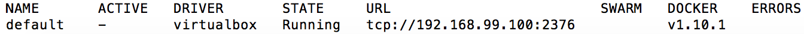
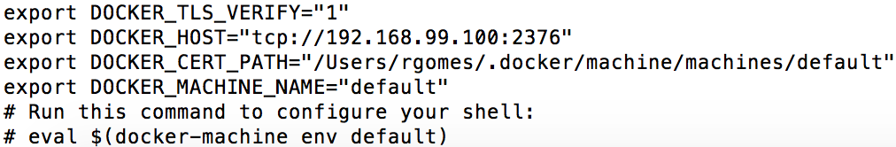

# Boas-vindas ao meu repositório do projeto Car Shop!

Quer ver o projeto funcionando dentro do ambiente do MongoDB?

 Utiliza Linux? Pule as etapas **1 a 5**. 
 
 Utiliza Windows? Siga o seguinte passo a passo:
  - **⚠ Retirado do tutorial [Como usar Docker sem GNU/Linux](https://stack.desenvolvedor.expert/appendix/docker/macos_e_windows.html)**

  1º - Instale o Docker, que é um gerenciador de ambientes virtuais, em sua máquina:
      Pode achar o que melhor se adequa a sua versão de Sistema Operacinal (S.O.) [aqui](https://www.docker.com/products/docker-desktop/);

  2º - Primeiro verificamos se não existem máquinas virtuais com Docker instaladas em seu ambiente com o comando `docker-machine ls`, dentro do terminal (`Prompt de Comando`). Este comando verifica as maquinas virtuais (M.V.) criadas na sua máquina. Caso não retorne nehhuma, crie uma com o comando `docker-machine create --driver virtualbox default` (ainda dentro do terminal), o retorno será algo como:
  

  3º - Para desligar a máquina virtual(M.V.), basta executar o comando `docker-machine stop default`;

  4º - Para iniciar, novamente, a máquina, basta executar o comando `docker-machine start default`;

  5º -  O comando `docker-machine env default` aplica as variaveis de ambiente necessárias para que os aplicativos de controle das M.V.'s (Docker e Docker-compose), funcione corretamente. O retorno será algo como a seguinte imagem:
  

  - Que são os comandos necessários para configurar todas as variáveis. Você pode copiar as quatros primeiras linhas, que começam com “export”, e colar no terminal ou, pegar apenas a última linha sem o “#” do início e executar na linha de comando `eval $(docker-machine env default)`;

  **⚠ Antes de começar, seu docker-compose precisa estar na versão 1.29 ou superior. [Veja aqui](https://www.digitalocean.com/community/tutorials/how-to-install-and-use-docker-compose-on-ubuntu-20-04-pt) ou [na documentação](https://docs.docker.com/compose/install/) como instalá-lo. No primeiro artigo, você pode substituir onde está com `1.26.0` por `1.29.2`.**

  6º - Rode os serviços `node` e `db` com o comando `docker-compose up -d`.

  - Esses serviços irão inicializar um container chamado `car_shop` e outro chamado `car_shop_db`.
  - A partir daqui você pode rodar o container `car_shop` via CLI ou abri-lo no VS Code, utilizando o comando `docker exec -it car_shop bash`, que te dará acesso ao terminal interativo do container criado pelo compose, que está rodando em segundo plano.

  - Instale as dependências com `npm install`, **DENTRO** do container, ou seja, no terminal que aparece após a execução do comando `docker exec -it car_shop bash` citado acima. 

  - ✨ **Dica:** A extensão `Remote - Containers` (que estará na seção de extensões recomendadas do VS Code) é indicada para que você possa desenvolver sua aplicação no container Docker direto no VS Code, como você faz com seus arquivos locais.

# 👨‍💻 O que foi desenvolvido

  Neste projeto, foi aplicado os princípios de Programação Orientada a Objetos (`POO`) para a construção de uma API com `CRUD` para gerenciar uma concessionária de veículos. Isso foi feito utilizando o banco de dados `MongoDB` através do framework do `Mongoose`.
# Orientações
<details>
  <summary><strong>🛠 Execução de testes localmente</strong></summary>

  Foi realizado a implementação de testes unitários na camada Service. Foi utilizado as bibliotecas `Sinon`, `Chai` e `Mocha` integrando o Mongoose para acessar as camadas conforme a camada.

  **Ainda está em processo de aprimoramento, onde irei implementar os testes unitários nas camadas `Model` e `Controller`. Além dos testes de intrgração.**

  Para executar os testes localmente, digite no terminal o comando `npm run test:mocha` **dentro do terminal do container (`docker exec -it car_shop bash`)**.

  Para executar apenas um teste por vez, basta executar o comando `npm run test:mocha`.

  Você também pode desabilitar temporariamente um teste utilizando a função `skip` junto à função `describe`. Como o nome indica, a função a seguir "pula" um teste:

  ```
  describe.skip('...', () => {})
  ```
  <br>
</details>


# Me dê feedbacks sobre o projeto!

Entre em contato pelas redes sociais e me dê dicas, conselhos e informações que julgar necessario para o meu crescimento como dev.

[](https://github.com/erikadeolima)
[](https://www.linkedin.com/in/erikadeolima/)
[](mailto:erikadeo.lima@hotmail.com)